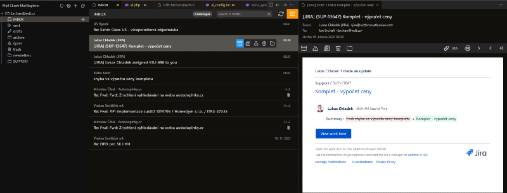

  

# Mail Client
A simple and efficient IMAP email client directly within your VS Code (or any other compatible editor like Cursor or Antigravity). In Markdown mode, you can leverage AI autocomplete to assist with writing your email text.

## Features

- **Account Management:** Add, edit, and remove IMAP accounts through a user-friendly interface.
- **Email Browsing & Search:** Access folders from the sidebar, browse messages, and search within folders using IMAP search features.
- **Compose Interface:** WYSIWYG rich text editor with Markdown fallback mode.
- **Basic Operations:** Reply to messages, forward, and delete emails.
- **Attachments:** Support for uploading and downloading email attachments. Added support for local file selection even when connected to Remote SSH.
- **Folder Management:** Map special folders and create custom folder buttons.
- **Image Whitelist:** Whitelist trusted senders to automatically load remote images in future emails.
- **Organize Messages:** Archive, Spam, Trash, and Inbox actions with context-aware buttons.
- **Address Book:** Manage your email contacts and use autocomplete in the `To`, `Cc`, and `Bcc` fields. Add unknown contacts easily with a single click.
- **Jira Integration:** Pair emails with Jira issues and post comments directly from the message detail view.
- **Print Support:** Capability to print messages via the native OS prompt directly from the UI.
- **Customizable Layout:** Choose between Side or Bottom panel for viewing message details in Split View.
- **Connection Reliability:** Configurable keepalive mechanism using IMAP `NOOP` commands and automatic reconnection attempts to prevent and resolve session timeouts.

## Requirements

- VS Code version 1.85.0 or newer.
- IMAP account (e.g., Gmail, Outlook, custom server).

## License

This project is licensed under the Apache License 2.0 - see the [LICENSE](LICENSE) file for details.
